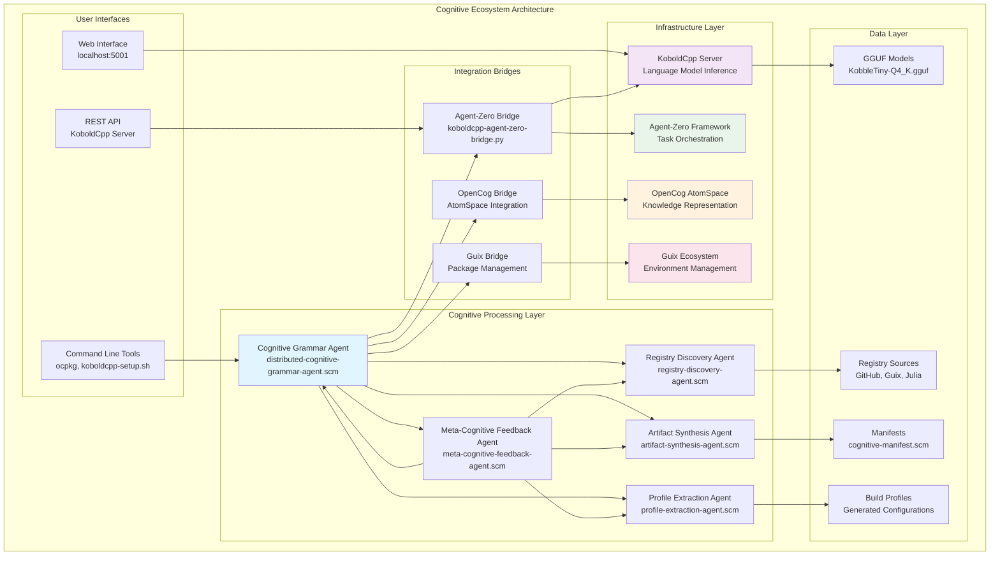
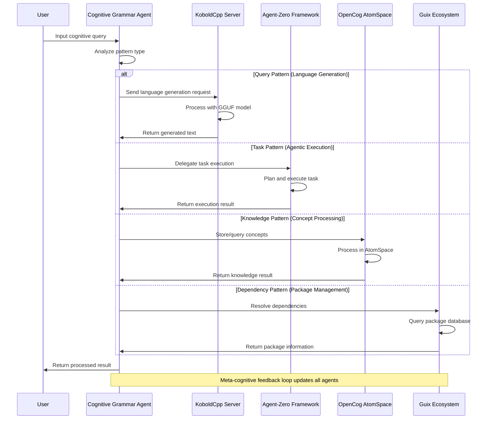
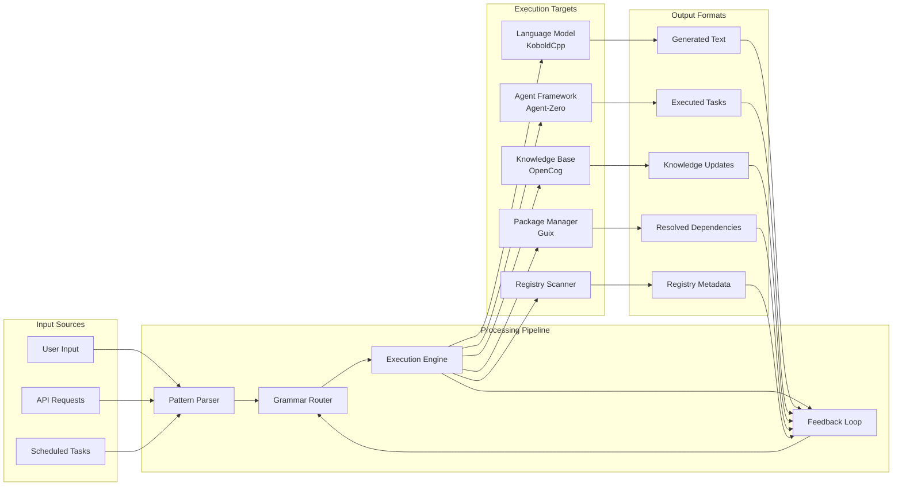

# Technical Architecture Documentation

**Generated for issue #78**: *generate technical architecture documentation with mermaid diagrams*  
**Part of madness meta-issue #68**

## Overview

This document describes the technical architecture of the OpenCog/Guix Cognitive Ecosystem as enhanced by the "madness" initiative (issue #68). The system integrates multiple components to form a distributed network of agentic cognitive grammar processing.

## System Architecture



## Cognitive Grammar Processing Flow



## Component Details

### 1. KoboldCpp Language Model Server (Issues #71-#76)

**Purpose**: Local language model inference  
**Technology**: Python, GGUF models  
**Endpoint**: `http://localhost:5001`

**Key Features**:
- Small footprint GGUF model (KobbleTiny-Q4_K.gguf)
- REST API for text generation
- Web interface for interactive use
- Mobile browser compatibility

**Integration Points**:
- Agent-Zero bridge for programmatic access
- Cognitive Grammar Agent for language processing
- Meta-cognitive feedback for model optimization

### 2. Agent-Zero Framework Integration (Issue #70)

**Purpose**: Agentic task orchestration and execution  
**Technology**: Python bridge integration  
**Repository**: https://github.com/agent0ai/agent-zero

**Bridge Implementation**:
```python
class KoboldCppBridge:
    def generate_text(self, prompt, max_length=100):
        # Sends requests to KoboldCpp API
        # Returns generated text for agent processing
```

### 3. Distributed Cognitive Grammar Network (Issue #77)

**Purpose**: Coordinate between different cognitive systems  
**Technology**: Guile Scheme agents  
**Architecture**: Hypergraph-based routing

**Network Nodes**:
- Language Model Server (KoboldCpp)
- Agentic Orchestrator (Agent-Zero)
- Knowledge Representation (OpenCog)
- Environment Management (Guix)
- Resource Discovery (Registry agents)

**Grammar Patterns**:
- Query patterns → Language model
- Task patterns → Agent-zero
- Knowledge patterns → OpenCog
- Dependency patterns → Guix
- Discovery patterns → Registry agents

### 4. Environment Management (Issues #69, Guix Integration)

**Gitpod Workspace Setup**:
```bash
# Automated via koboldcpp-setup.sh
docker pull gitpod/workspace-python-3.10:2025-07-23-06-50-33
```

**Guix Manifest Dependencies**:
- AI/ML frameworks (numpy, scipy)
- HTTP clients (requests, curl)
- Development tools (gcc, cmake, make)
- Container support (docker)

## Data Flow Architecture



## Deployment Architecture

```mermaid
deployment
    node "Gitpod Workspace" {
        component "KoboldCpp Server" as KCP
        component "Agent-Zero Bridge" as AZB
        component "Cognitive Agents" as CA
        
        KCP --> AZB : HTTP API
        AZB --> CA : Python Bridge
    }
    
    node "Local Development" {
        component "Guix Environment" as GE
        component "OpenCog AtomSpace" as OC
        component "Build Tools" as BT
        
        GE --> OC : Native Integration
        GE --> BT : Package Management
    }
    
    cloud "External Resources" {
        storage "HuggingFace Models" as HF
        storage "GitHub Repositories" as GH
        storage "Package Registries" as PR
        
        HF --> KCP : Model Download
        GH --> CA : Registry Discovery
        PR --> GE : Package Resolution
    }
    
    database "Local Storage" {
        folder "Models" as MOD
        folder "Profiles" as PROF
        folder "Artifacts" as ART
        
        KCP --> MOD : GGUF Files
        CA --> PROF : Build Profiles
        CA --> ART : Generated Manifests
    }
```

## Security and Resource Considerations

### Resource Requirements
- **CPU**: Moderate (language model inference)
- **Memory**: 2GB+ (GGUF model loading)
- **Storage**: 1GB+ (models and artifacts)
- **Network**: Outbound HTTPS (model downloads, registry access)

### Security Measures
- Local model inference (no external API calls)
- Sandboxed execution environments
- Manifest-driven reproducible builds
- Version-controlled configuration

## API Reference

### KoboldCpp Server API
```
POST /api/v1/generate
{
  "prompt": "string",
  "max_length": 100,
  "temperature": 0.7
}
```

### Cognitive Grammar Agent Interface
```scheme
(process-cognitive-grammar "generate a reasoning framework")
(bridge-to-koboldcpp "explain quantum computing")
(bridge-to-agent-zero "execute code generation task")
```

### Agent-Zero Bridge
```python
bridge = KoboldCppBridge()
result = bridge.generate_text("cognitive architecture design")
```

## Testing and Validation

### Automated Tests
- `koboldcpp-setup.sh --status` - Server health check
- `cognitive-grammar-integration-agent.scm --test` - Integration test
- `test-cognitive-flowchart.sh` - End-to-end pipeline test

### Manual Validation
1. Web interface accessibility at `http://localhost:5001`
2. Agent-zero bridge functionality
3. Cognitive grammar pattern recognition
4. Package dependency resolution

## Future Extensions

### Planned Enhancements
- Multi-model support (larger GGUF models)
- Distributed deployment (multiple nodes)
- Advanced cognitive patterns
- Real-time feedback optimization
- Enhanced security measures

### Integration Opportunities
- Additional AI frameworks (PyTorch, TensorFlow)
- Cloud deployment options
- Mobile application interfaces
- External knowledge bases

---

*This documentation is part of the OpenCog/Guix Cognitive Ecosystem initiative and addresses the requirements specified in issue #68 "madness".*